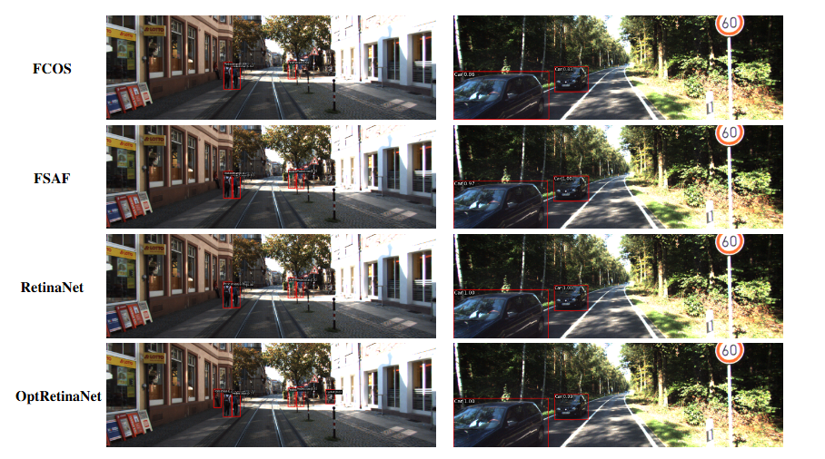

# Optimizing RetinaNet Anchors Using Differential Evolution for Improved Object Detection
## Abstract
Object detection is a fundamental task in computer vision. It has two primary types: one-stage detectors known for their
high speed and efficiency, and two-stage detectors, which offer higher accuracy but are often slower due to their complex
architecture. Balancing these two aspects has been a significant challenge in the field. RetinaNet, a premier single-stage object
detector, is renowned for its remarkable balance between speed and accuracy. Its success is largely due to the groundbreaking
focal loss function, which adeptly addresses the issue of class imbalance prevalent in object detection tasks. This innovative
approach significantly enhances detection accuracy while maintaining high speed, making RetinaNet an ideal choice for a wide
range of real-world applications. However, its performance decreases when applied to datasets containing objects with unique
characteristics, such as objects with elongated or squat shapes. In such cases, the default anchor parameters may not fully
meet the requirements of these specialized objects. To overcome this limitation, we present an enhancement to the RetinaNet
model to improve its ability to handle variations in objects across different domains. Specifically, we propose an optimization
algorithm based on differential evolution that adjusts anchor scales and ratios while determining the most appropriate number of
these parameters for each dataset based on the annotated data. Through extensive experiments on datasets spanning diverse
domains such as Karlsruhe Institute of Technology and Toyota Technological Institute (KITTI), Unconstrained Face Detection
Dataset (UFDD), and TomatoPlantFactoryDataset, we demonstrate that our proposed technique significantly outperforms the
original RetinaNet and anchor-free methods by a considerable margin.
## Quick Start
### Prerequisites 
#### Step 0. Download and install Miniconda from the [official website.](https://www.anaconda.com/docs/main)
#### Step 1. Create a conda environment and activate it.
```
conda create --name OptRetinaNet python=3.8 -y
conda activate OptRetinaNet
```
#### Step 2. Install [PyTorch](https://pytorch.org/get-started/locally/).
On GPU platforms:
```
conda install torch==1.8.1+cu101 torchvision==0.9.1+cu101 torchaudio==0.8.1
```
#### Step 3. Install [MMCV.](https://github.com/open-mmlab/mmcv) 
```
conda install mmcv-full==1.7.0
```
### Installation
#### Step 0. Install OptRetinaNet
```
git clone https://github.com/Asaad-Nasrallah/OptRetinaNet.git
cd mmdetection-2.25.3
pip install -v -e .
```
### Data preparation
#### Kitti Dataset
##### Step 0. Download [Kitti Dataset](https://www.cvlibs.net/datasets/kitti/).
The directory will be as follows.
```
kitti
├── train
│   ├── image_2
│   ├── label_2
├── val
│   ├── image_2
│   ├── label_2
```
### Test OptRetinaNet on Kitty and evaluate the mAP.
```
python tools/test.py \
    configs/retinanet/retinanet_r101_fpn_2x_coco.py \
    --eval mAP
```
### Benchmark
| Model       | Backbone        | Car  | Pedestrian | Cyclist |
|------------|---------------|------|------------|---------|
| FCOS  | ResNet50      | 87.4% | 80.2%      | 86.7%   |
| FSAP  | ResNet50      | 87.9% | 81.8%      | 86.0%   |
| DETR  | ResNet50      | 90.1% | 82.6%      | 88.8%   |
| RetinaNet  | ResNet50 | 89.6% | 80.8%      | 86.5%   |
| **OptRetinaNet**  | ResNet50 | 90.3% | 84.2%      | **91.0%**   |
| FCOS  | ResNet101     | 88.7% | 81.6%      | 88.2%   |
| FSAP  | ResNet101     | 89.3% | 83.4%      | 87.6%   |
| DETR  | ResNet101     | 91.7% | 83.9%      | 90.2%   |
| RetinaNet  | ResNet101 | 92.9% | 75.8%      | 88.9%   |
| **OptRetinaNet**  | ResNet101 | 93.2% | 84.5%      | **90.6%**   |
| Swin-T | Swin Transformer | 84.5% | 74.6%      | 82.4%   |
| YOLOv8 | CSPDarknet   | 87.4% | 71.8%      | 81.0%   |
### Object Detection Results



